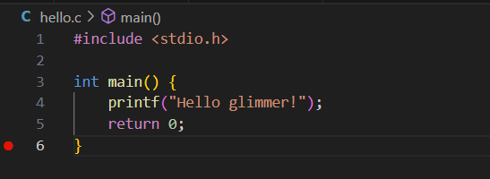

# CS-EASY-01
## 第一个程序
创建一个新的文件hello.c,输入以下内容

    #include <stdio.h>

    int main() {
        printf("Hello, world!");
        return 0;
    }

##### 高级计算机语言与低级计算机语言，各有什么优劣，你更喜欢哪一类计算机语言？
###### 高级计算机语言的优劣
优点
1.易读性和可维护性高：高级语言的语法和结构更接近人类的自然语言和思维方式。
2.开发效率高：高级语言提供了丰富的内置函数、库和数据结构，能够让开发者快速地实现复杂的功能。
缺点
1.执行效率相对较低：高级语言编写的程序需要经过解释器或编译器的转换才能在计算机硬件上运行，这个过程会带来一定的性能损耗。
2.对硬件的控制能力弱：高级语言通常隐藏了计算机硬件的细节，这使得开发者在需要直接操作硬件资源（如寄存器、内存地址等）时会受到限制。  
###### 低级计算机语言的优劣
优点
1.执行效率高：低级语言（如汇编语言）可以直接操作计算机硬件，编写的程序与机器指令一一对应，能够最大限度地发挥硬件的性能。
2.对硬件的控制精确：可以直接访问和控制计算机的硬件资源，包括寄存器、内存地址等。
缺点
1.开发难度大：低级语言的语法和指令与计算机硬件紧密相关，学习曲线陡峭。
2.可移植性差：低级语言编写的程序高度依赖于特定的硬件平台和指令集架构。

个人偏好：我更喜欢高级语言，易读懂

#### 尝试解读hello.c中每一行的内容。

    #include <stdio.h>                //引入标准输入输出头文件

    int main() {                      //从main函数开始执行,int是其返回值类型
        printf("Hello, world!");      //调用printf函数，格式化输出指定内容
        return 0;                     //向main函数返回0，表示程序正常结束
    }

#### 删去该程序的哪一行不会影响运行结果？
return 0；
#### int类型是计算机存储什么元素的方式？为什么main函数要使用int进行声明/定义？
整型变量；main的返回值必须是int，这样返回值才能传给程序调用者如操作系统，同时便于后续检查程序是否正常运行。
#### 请调整上述程序的内容，使其输出内容改为Hello glimmer!并附上运行截图

## 基础语法运用
接下来，让我们进行基础语法的学习验收部分~  
情景如下：  
小明是一个黑客大神（大嘘），他喜欢采用最朴素的盗号方式――“验证码发我一下”。  
现在，小明想要编写一个程序，实现“盗号自动化”具体要求为：    
运行程序后仅输出一遍Show me your code,please.，然后等待用户输入一串数字，以回车结束。  
如果输入的内容为6位数字，则程序输出I am super hacker!并结束程序  
如果输入的内容不足或多于六位，则程序输出Fake code!并要求用户重新输入直至验证码为六位数字。  
以下是粗心的小明写出的C语言程序源代码，请你修改其中的内容使其能够满足他的需求，助力他成为超级黑客！  

    #include <cstdio>

    int mian() {
        short code;
        for(true){
		    printf("Show me your code,please.")；
            scanf("%d",code);
            if(code >= 100000 || code <= 999999)printf("I am super hacker!");
            return 0;
            else printf(Fake code!);
        }
        return 0;
    }

#### 修改后的代码：
    #include <stdio.h>

    int main() 
    {
        long code;
        int inputCorrect = 0;
        while (!inputCorrect) {
            printf("Show me your code,please.\n");
            scanf("%ld",&code);
            
            // 清除输入缓冲区中的剩余字符
        int c;
        while ((c = getchar())!= '\n' && c!= EOF);
            
            if (code >= 100000 && code <= 999999) {
                printf("I am super hacker!\n");
                inputCorrect = 1;
            } else {
                printf("Fake code!\n");
            }
        }
        return 0;
    }

## 课后题
在说明文档之外，请提交一份C语言代码，要求编译后的程序实现输入两个整数m,n，输出它们的最大公约数。其中0<m,n<2^31。
   
    #include <stdio.h>
    //辗转相除法
    int gcd(int a, int b) {
        int temp;
        while (b!= 0) {
            temp = b;
            b = a % b;
            a = temp;
     }
     return a;
    }

    int main() {
     unsigned int m, n;
        printf("请输入两个数（用空格隔开）: ");
        scanf("%d %d", &m, &n);
        int result = gcd(m, n);
        printf("%d 和 %d 的最大公约数是 %d.\n", m, n, result);
        return 0;
    }